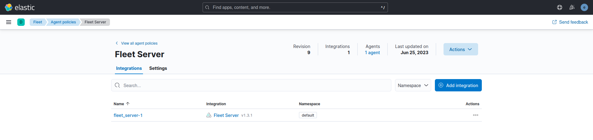
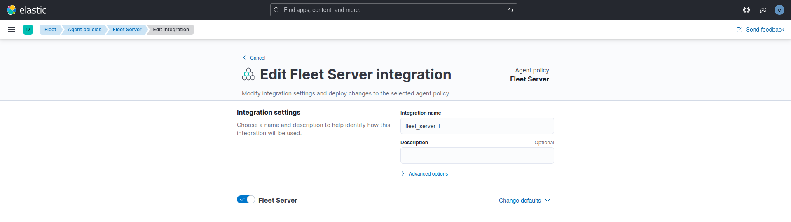
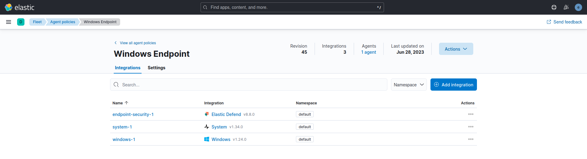
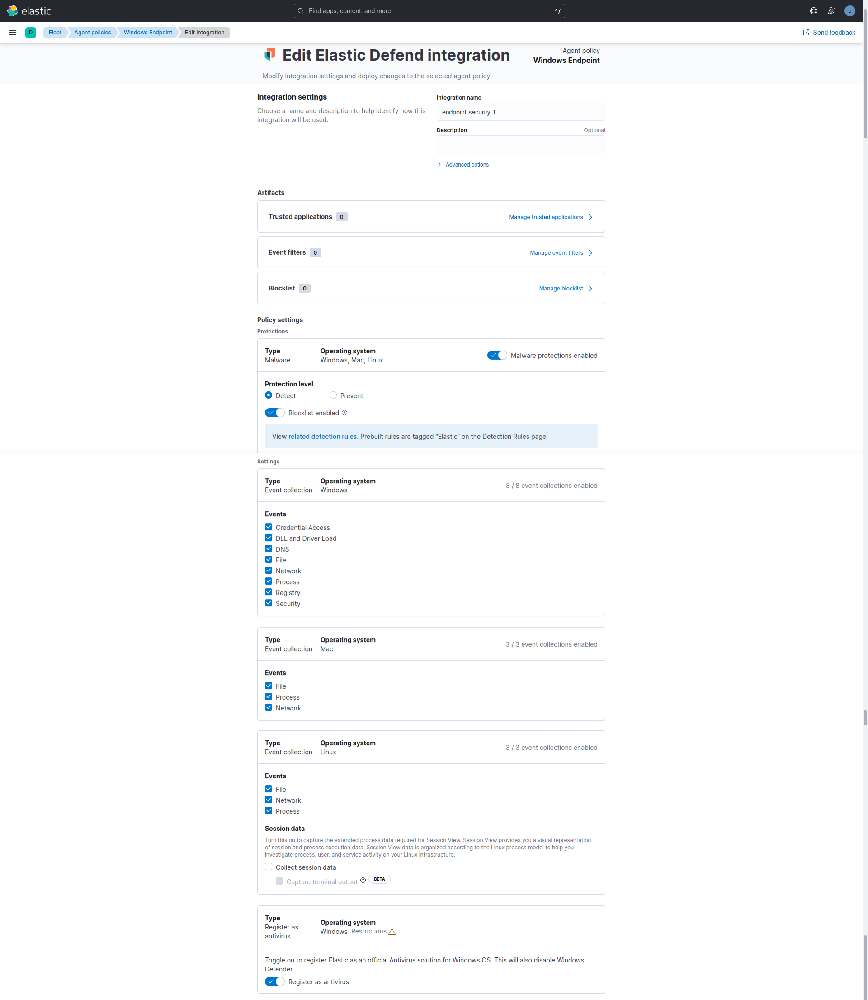
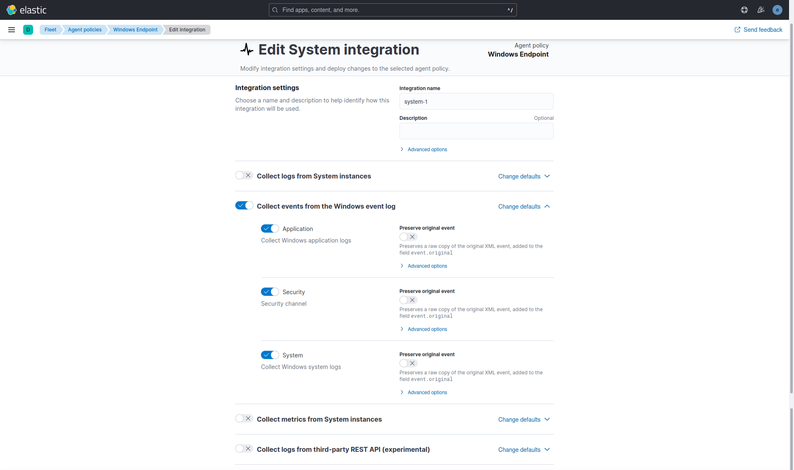
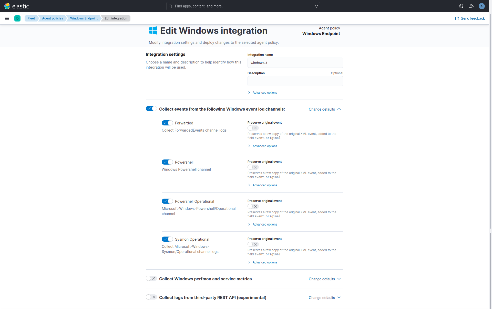
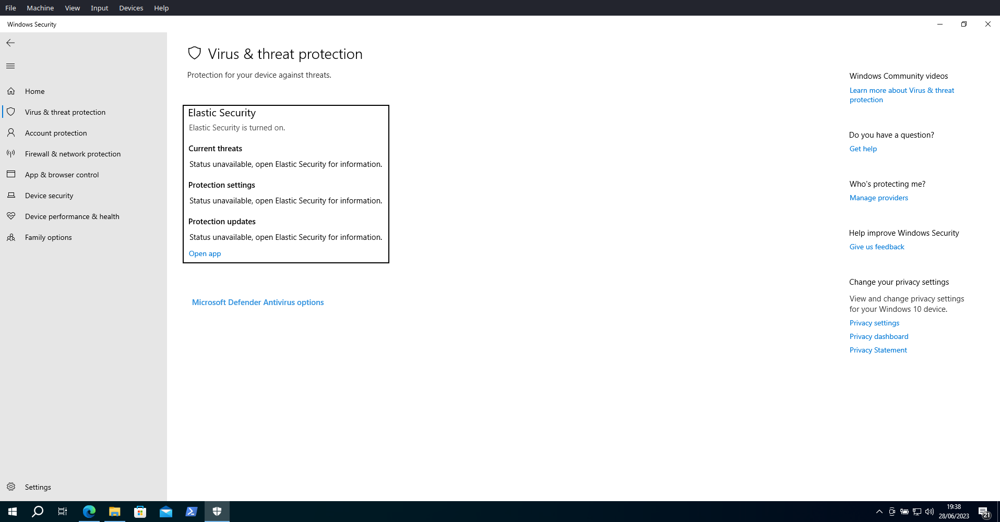
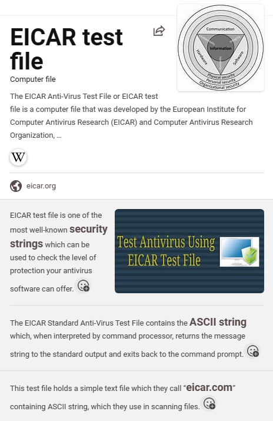
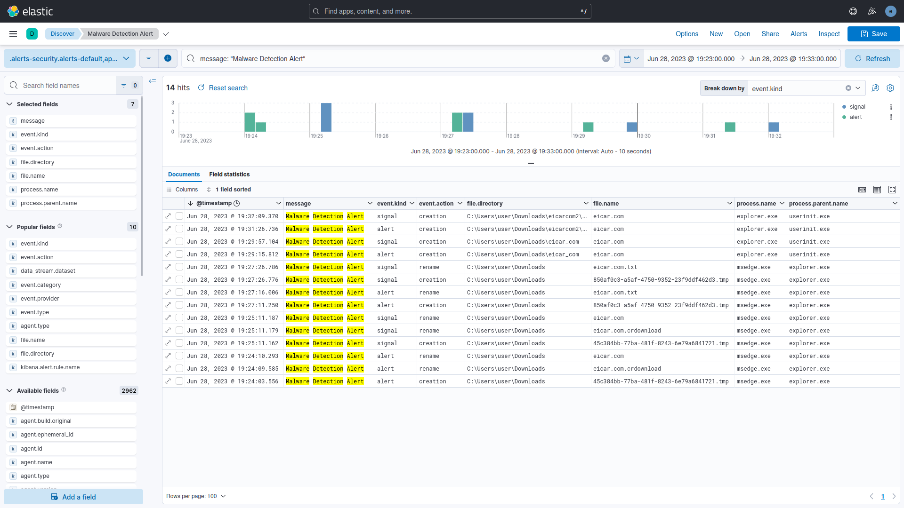
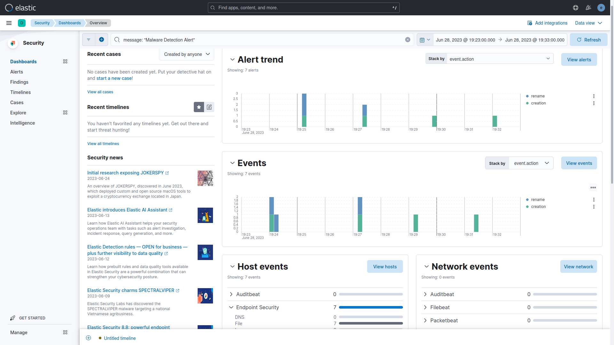

# Threat Hunting with Elastic Stack 8
- Configured in VirtualBox:
  - DHCP Server:
    - Ubuntu VM (Elastic Host)
    - Windows 10 VM (Victim)
- Configured Elastic 8.8:
  - Elastic Stack: Elasticsearch and Kibana (Web UI).
  - Integrations: Fleet Server, Elastic Agent, Elastic Defend, System, and Windows.
- Simulated two scenarios:
  - First Scenario: EICAR Malware Test.
  - Second Scenario: MITRE ATT&CK Test.

# Highlights

## Elastic Host and Victim Setup

### 1 - Fleet Agents

#### 1.1 - Fleet Server Policy

#### 1.1.1 - Fleet Server Integration

#### 1.2 - Windows Endpoint Policy

#### 1.2.1 - Elastic Defend Integration

#### 1.2.2 - System Integration

#### 1.2.3 - Winows Integration

### 2 - Endpoint Security Rule

### 3 - Windows Security

#### 3.1 - Elastic Security Antivirus
Use Elastic Security Antivirus from the Elastic Defender Integration instead of Microsoft Defender Antivirus or disable Real-time protection from Microsoft Defender Antivirus.

#### 3.2 - Microsoft Defender SmartScreen

## First Scenario: EICAR Malware Test.

### 4.1 - EICAR Malware Description

### 4.2 - EIRCAR Website

### 4.3 - EICAR Files
EICAR downloaded and extracted files.

### 5.1 - Elastiv Analytics Discover

### 5.2 - Elastic Scuity Dashboard Overview

### 5.3 - Elastic Security Alerts

## Second Scenario: MITRE ATT&CK Test.
