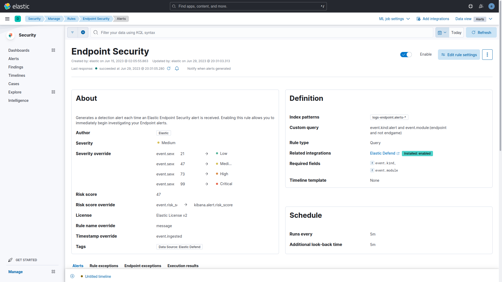
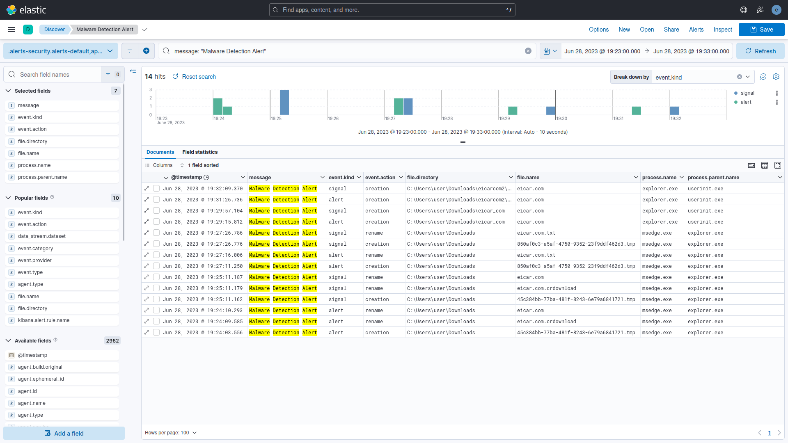
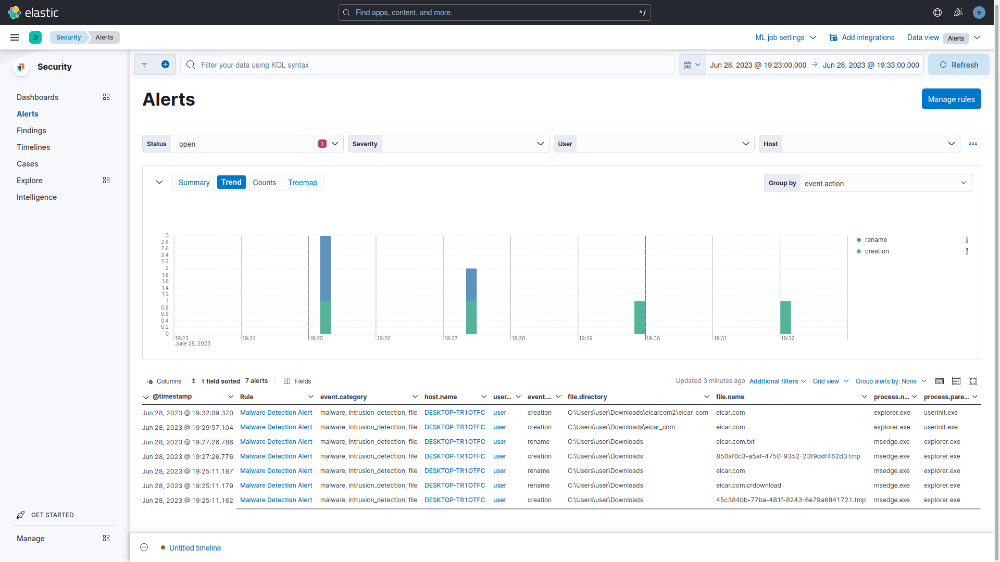

# Threat Hunting with Elastic Stack 8
- Configured in VirtualBox:
  - DHCP Server:
    - Ubuntu VM (Elastic Host)
    - Windows 10 VM (Victim)
- Configured Elastic 8.8:
  - Elastic Stack: Elasticsearch and Kibana (Web UI).
  - Integrations: Fleet Server, Elastic Agent, Elastic Defend, System, and Windows.
- Simulated two tests:
  - EICAR Malware Test.
  - MITRE ATT&CK Test with Red Team Automation (RTA).

# Highlights

## 1 - Fleet Server and Victim Setup

### 1.1 - Fleet and Elastic Agents
Fleet provides a web-based UI in Kibana for centrally managing Elastic Agents and their policies. Fleet serves as the communication channel back to the Elastic Agents. Agents check in for the latest updates on a regular basis. When you make a change to an agent policy, all the agents receive the update during their next check-in. To upgrade your Elastic Agent binaries or integrations, you can initiate upgrades in Fleet, and the Elastic Agents running on your hosts will upgrade automatically.

Elastic Agent is a single, unified way to add monitoring for logs, metrics, and other types of data to a host. It can also protect hosts from security threats, query data from operating systems, forward data from remote services or hardware, and more. A single agent makes it easier and faster to deploy monitoring across your infrastructure. Each agent has a single policy you can update to add integrations for new data sources, security protections, and more. Elastic integrations are powered by Elastic Agent.

All communication between the Fleet UI and Fleet Server happens through Elasticsearch. Fleet writes policies, actions, and any changes to the fleet-* indices in Elasticsearch. Each Fleet Server monitors the indices, picks up changes, and ships them to the Elastic Agents. To communicate to Fleet about the status of the Elastic Agents and the policy rollout, the Fleet Servers write updates to the fleet-* indices.

### 1.2 - Fleet Server Policy
In the Flee Server Policy we are using only the Fleet Server integration. The System integration can be added to monitor the host acting as a server.

#### 1.2.1 - Fleet Server Integration
Fleet Server is the mechanism to connect Elastic Agents to Fleet. It allows for a scalable infrastructure, can support many Elastic Agent connections, and is supported in Elastic Cloud and self-managed clusters. Fleet Server is a separate process that communicates with the deployed Elastic Agents. It’s launched as part of an Elastic Agent on a host intended to act as a server. It is responsible for updating agent policies, collecting status information, and coordinating actions across Elastic Agents.

### 1.3 - Windows Endpoint Policy
In the Windows Endpoint Policy we are using the Elastic Defend, System, and Windows integrations.

#### 1.3.1 - Elastic Defend Integration
Elastic Defend provides prevention, detection, and response capabilities across Windows, macOS, and Linux operating systems running on both traditional endpoints and public cloud environments. ​​Use Elastic Defend to:
- Prevent complex attacks (Malware, Ransomware, Advanced Threats,...)
- Alert in high fidelity
- Detect threats in high fidelity
- Triage and respond rapidly
- Secure cloud workloads
- View terminal sessions

Generated indices:
- Logs - The log type of documents are stored in the logs-endpoint.* indices. The following sections define the mapped fields sent by the endpoint.
    - alerts, file, library, network, process, registry, security.
- Metrics - The metrics type of documents are stored in metrics-endpoint.* indices. Metrics documents contain performance information about the endpoind executable and the host it is running on. The following section define the mapped fields sent by the endpoint.
    - metadata, metrics, policy response.

#### 1.3.2 - System Integration
The System integration allows you to monitor servers, personal computers, and more. Use the System integration to collect metrics and logs from your machines. Then visualize that data in Kibana, create alerts to notify you if something goes wrong, and reference data when troubleshooting an issue.

The System integration collects two types of data: logs and metrics.
- **Logs** help you keep a record of events that happen on your machine. Log data streams collected by the System integration include **application**, **system**, and **security** events on machines running Windows and **auth** and **syslog** events on machines running macOS or Linux.
- Metrics give you insight into the state of the machine. Metric data streams collected by the System integration include **CPU usage**, **load statistics**, **memory usage**, **information on network behavior**, and more.

#### 1.3.3 - Winows Integration
The Windows integration allows you to monitor the Windows OS, services, applications, and more. Use the Windows integration to collect metrics and logs from your machine. Then visualize that data in Kibana, create alerts to notify you if something goes wrong, and reference data when troubleshooting an issue.

The Windows integration collects two types of data: logs and metrics.
- **Logs** help you keep a record of events that happen on your machine. Log data streams collected by the Windows integration include **forwarded events**, **PowerShell events**, and **Sysmon events**. Log collection for the Security, Application, and System event logs is handled by the System integration.
- **Metrics** give you insight into the state of the machine. Metric data streams collected by the Windows integration include **service details** and **performance counter** values.

### 1.4 - Endpoint Security Rule
The Endpoint Security Rule generates a detection alert (signal) each time an Elastic Endpoint Security alert is received. Enabling this rule allows you to investigate your Endpoint alerts on Elastic Security.

### 1.5 - Windows Security

#### 1.5.1 - Elastic Security Antivirus
Use Elastic Security Antivirus from the Elastic Defender Integration instead of Microsoft Defender Antivirus or disable Real-time protection from Microsoft Defender Antivirus.

#### 1.5.2 - Microsoft Defender SmartScreen
Disable the SmartScreen for Microsoft Edge to be able to download the files in the EICAR Malware Test.

## 2 - First Scenario: EICAR Malware Test.

### 2.1.1 - EICAR Malware Description

### 2.1.2 - EIRCAR Website

### 2.1.3 - EICAR Files
EICAR downloaded and extracted files.

### 2.2.1 - Elastiv Analytics Discover

### 2.2.2 - Elastic Scuity Dashboard Overview

### 2.2.3 - Elastic Security Alerts

## 3 - MITRE ATT&CK Test with Red Team Automation (RTA)
[RTA](https://github.com/endgameinc/RTA) provides a framework of scripts designed to allow blue teams to test their detection capabilities against malicious tradecraft, modeled after [MITRE ATT&CK](https://attack.mitre.org/wiki/ATT&CK_Matrix).

RTA is composed of python scripts that generate evidence of over 50 different ATT&CK tactics, as well as a compiled binary application that performs activities such as file timestopping, process injections, and beacon simulation as needed.

Where possible, RTA attempts to perform the actual malicious activity described. In other cases, the RTAs will emulate all or parts of the activity. For example, some lateral movement will by default target local host (though with parameters typically allow for multi-host testing). In other cases, executables such as cmd.exe or python.exe will be renamed to make it appeas as if a Windows binary is doing non-standard activities..

### 3.1 - Alerts Over Time
All the 247 signals detected by 45 distinct rules.

### 3.2.1 - Detection Rules and Executables
Count of all the Security SIEM detection rules used to create the alerts.

### 3.2.2 - Pythons Scripts used by RTA

### 3.2.3 - Processes per Rule for the Top 10 Rules by Count of Records

### 3.3.1 - Detection Rules Techniques and Tactics

### 3.3.2 - Detection Signals in Time Order

