# Threat Hunting with Elastic Stack 8 (XDR)
This lab aims to explore Elastic Stack's detection and visualization capabilities by performing malicious tests on a Windows 10 machine. Using VirtualBox, a DHCP Server was created for an internal network with two virtual machines (VM): an Ubuntu Server (Elastic Host) and a Windows 10 (Victim). Both virtual machines have two network adapters, one connected to a NAT with internet access and the other to the internal network. The Elastic Stack 8 (XDR) was installed on the Ubuntu Server VM to detect malicious activity on the Windows 10 VM. The Elastic Agent was used to collect data from the victim's machine.

## Summary
- Configured in VirtualBox:
  - DHCP Server
  - Ubuntu Server (Elastic Host)
  - Windows 10 (Victim)
- Configured Elastic Stack 8 on Ubuntu Server:
  - Elastic Stack: Elasticsearch, Kibana (UI), and Integrations.
  - Integrations: Fleet Server, Elastic Agent, System, Windows, and Elastic Defend.
  - Added Fleet Server (Ubuntu Server) and Agent (Windows 10) using Elastic Agent.
- Simulated two malicious tests:
  - EICAR Malware Test.
  - MITRE ATT&CK Test with Red Team Automation (RTA).

## Procedure
The procedure to build this lab can be found [here](https://github.com/robsann/ElasticStackLab/blob/main/procedure.md) and it was adapted from [Reda BELHAJ](https://unencrypted.vercel.app/blog/threat-hunting-with-elasticstack).

## Diagram
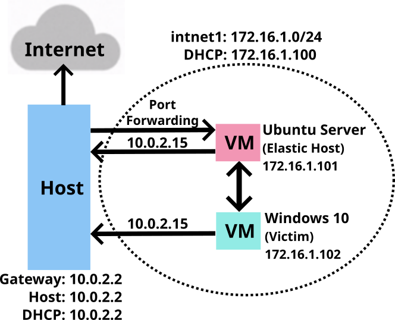

### IP Addresses
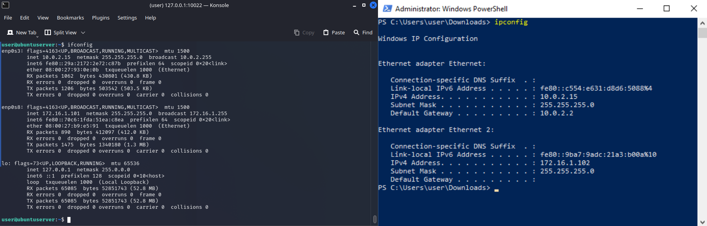

  
# Highlights

## 1 - Fleet, Elastic Agents, Policies and Victim Setup

### 1.1 - Fleet and Elastic Agents
**Fleet** provides a web-based UI in Kibana for centrally managing **Elastic Agents** and their policies. **Fleet** serves as the communication channel back to the **Elastic Agents**. **Agents** check in for the latest updates regularly. When an **agent policy** is changed, all the agents receive the update during their next check-in. To upgrade the **Elastic Agent** binaries or integrations, upgrades can be initiated in **Fleet**, and the **Elastic Agents** running on the hosts will upgrade automatically.

**Elastic Agent** is a unified way to add monitoring for logs, metrics, and other types of data to a host. It can also protect hosts from security threats, query data from operating systems, forward data from remote services or hardware, and more. A **single agent** makes it easier and faster to deploy monitoring across the infrastructure. Each **agent** has a **single policy** that can be updated to add integrations for new data sources, security protections, and more. **Elastic integrations** are powered by **Elastic Agent**.

All communication between the **Fleet UI** and **Fleet Server** happens through **Elasticsearch**. **Fleet** writes policies, actions, and any changes to the `fleet-*` indices in **Elasticsearch**. Each **Fleet Server** monitors the indices, picks up changes, and ships them to the **Elastic Agents**. To communicate to **Fleet** about the status of the **Elastic Agents** and the **policy rollout**, the **Fleet Servers** write updates to the `fleet-*` indices.

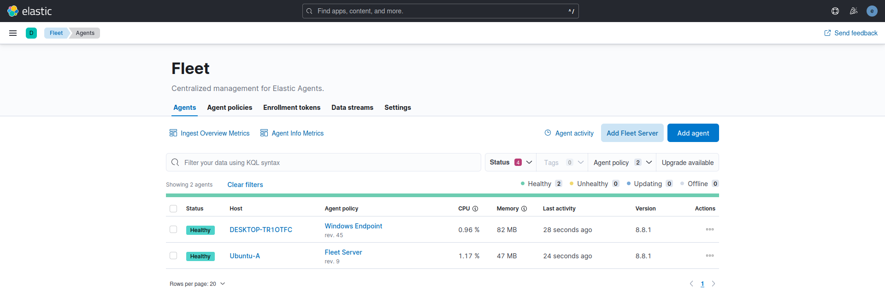

### 1.2 - Fleet Server Policy
The **Fleet Server Policy** includes only the **Fleet Server integration**. The **System integration** added automatically with the Fleet Server integration was removed. However, it can be kept if one wishes to collect logs and metrics to monitor the host acting as the Fleet Server.

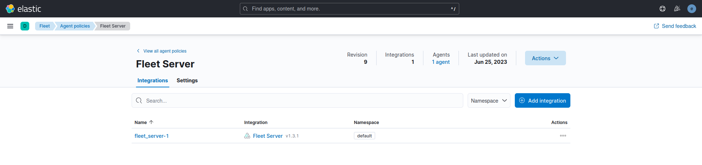

#### 1.2.1 - Fleet Server Integration
The **Fleet Server** is what connects **Elastic Agents** to **Fleet**. It can support an extensive infrastructure and handle numerous Elastic Agent connections. It is available for both Elastic Cloud and self-managed clusters. The **Fleet Server** is launched as a separate process within an Elastic Agent on a server and communicates with the deployed Elastic Agents. Its responsibilities include updating agent policies, gathering status information, and coordinating actions across Elastic Agents.

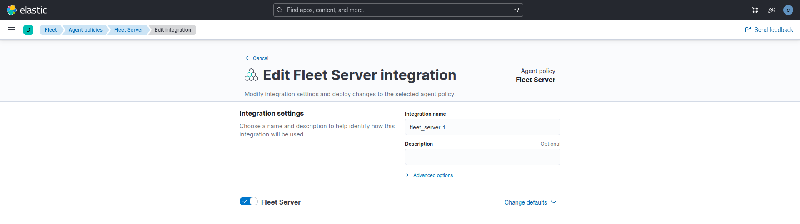

### 1.3 - Windows Endpoint Policy
The **Windows Endpoint Policy** comprises the **Elastic Defend**, **System**, and **Windows** integrations.

#### 1.3.1 - Elastic Defend Integration
The **Elastic Defend integration** provides prevention, detection, and response capabilities across Windows, macOS, and Linux operating systems running on traditional endpoints and public cloud environments. Here **Elastic Defend** was used for threat detection.

The **Elastic Defend integration** collects two types of data: **logs** and **metrics**.
- **Logs** - The log type of documents are stored in the `logs-endpoint.*` indices. The following sections define the mapped fields sent by the endpoint:
  - `alerts`, `file`, `library`, `network`, `process`, `registry`, and `security`.
- **Metrics** - The metrics type of documents are stored in `metrics-endpoint.*` indices. Metrics documents contain performance information about the endpoint executable and the host it is running on. The following section defines the mapped fields sent by the endpoint:
  - `metadata`, `metrics`, and `policy response`.

The **Malware** protection was enabled on the **Detect** mode and **Elastic** was registered as an official **Antivirus** solution for the Windows 10 VM, disabling the Windows Defender Antivirus.

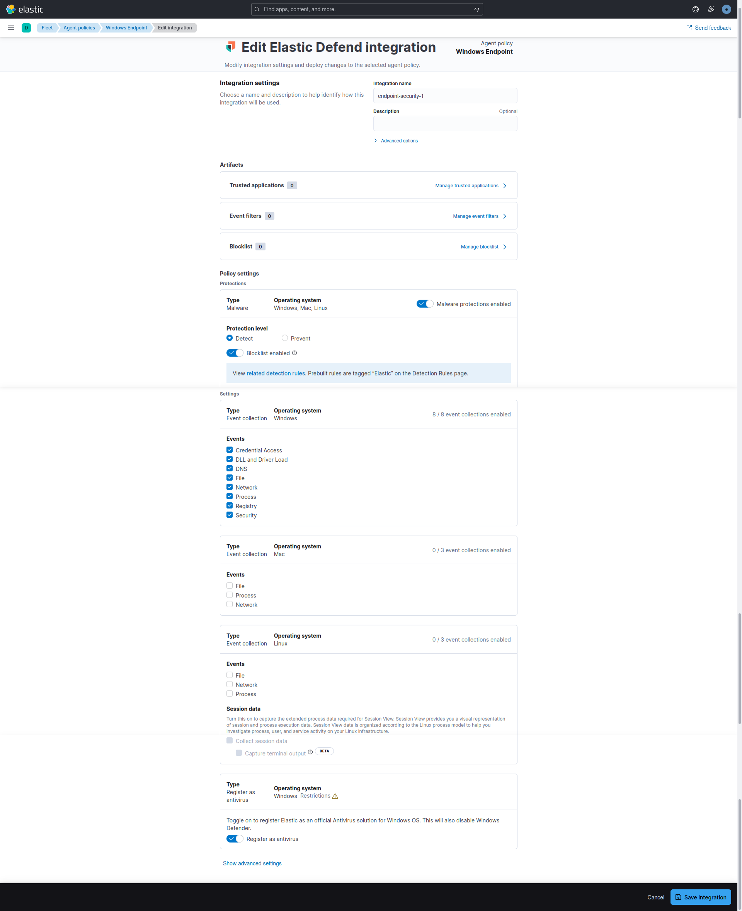

#### 1.3.2 - System Integration
The **System integration** allows for monitoring servers, personal computers, and other devices. This integration collects metrics (state) and logs (events) from the devices. The data collected can be visualized in Kibana, alerts can be created to notify if something goes wrong, and data can be referenced when troubleshooting an issue.

The **System integration** collects two types of data: **logs** and **metrics**.
- **Logs** help to keep a record of events that happen on the machine. Log data streams collected by the System integration include:
  - On **Windows** machines: `application`, `system`, and `security`.
  - On **macOS** or **Linux** machines: `auth` and `syslog`.
- **Metrics** give insight into the state of the machine. Metric data streams collected by the System integration include:
  - `CPU usage`, `load statistics`, `memory usage`, `information on network behavior`, and more.

In this configuration, only **logs** were collected.

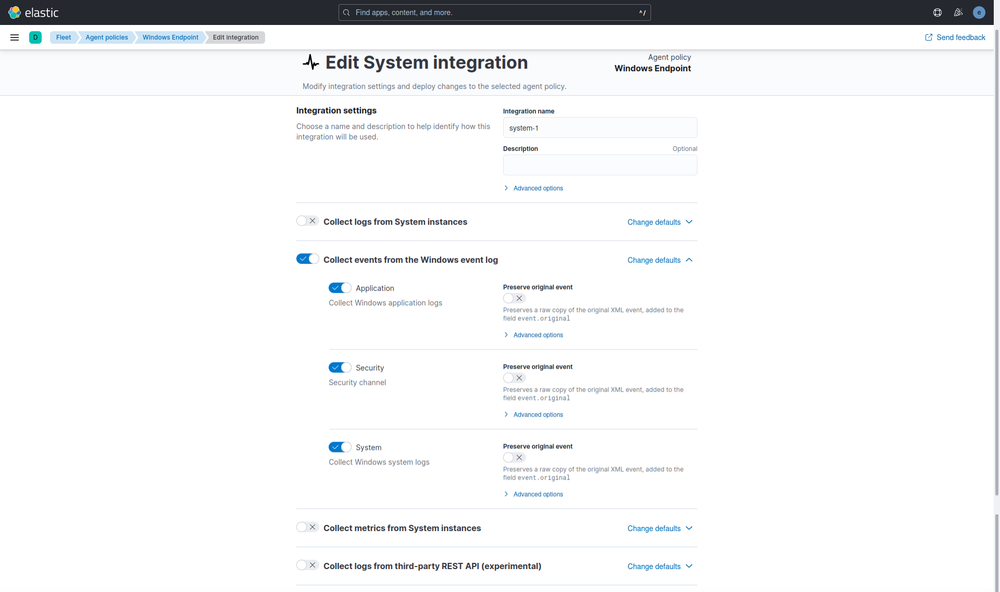

#### 1.3.3 - Winows Integration
The **Windows integration** allows monitoring of the Windows OS, services, applications, and more. The **Windows integration** collects metrics (state) and logs (events) from the machine. These data can be visualized in Kibana, alerts to notify if something goes wrong can be created, and data can be referenced when troubleshooting an issue.

The **Windows integration** collects two types of data: **logs** and **metrics**.
- **Logs** help to keep a record of events that happen on the machine. Log data streams collected by the Windows integration include:
	- `forwarded events`, `PowerShell events`, and `Sysmon events`.

	Log collection for the **Security**, **Application**, and **System** event logs is handled by the **System integration**.
- **Metrics** give insight into the state of the machine. Metric data streams collected by the Windows integration include:
	- `service details` and `performance counter` values.

In this configuration, only **logs** were collected.

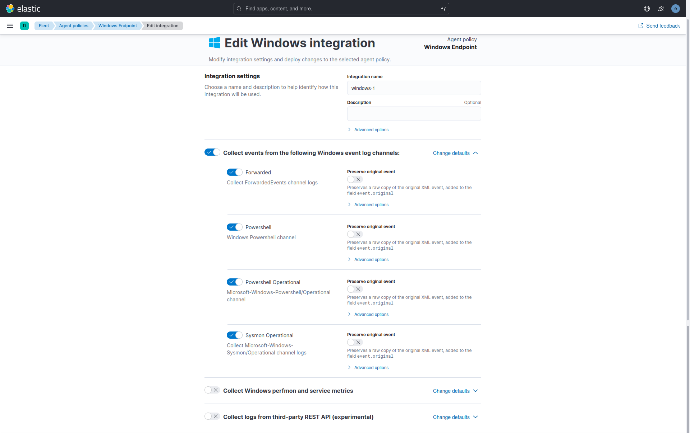

### 1.4 - Windows Security

#### 1.4.1 - Elastic Security Antivirus
The Elastic Security Antivirus from the Elastic Defender integration was used instead of the Microsoft Defender Antivirus. Alternatively, the Real-time protection from Microsoft Defender Antivirus can be turned off to perform the tests.

#### 1.4.2 - Microsoft Defender SmartScreen
The SmartScreen for Microsoft Edge was disabled to be able to download the malicious files in the EICAR Malware Test.

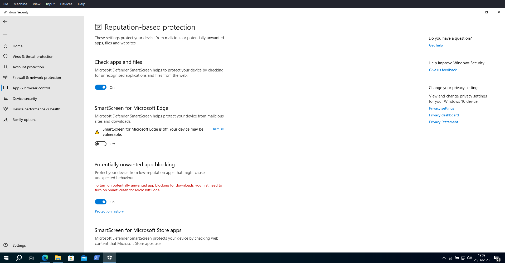

---

## 2 - EICAR Malware Test

The **EICAR Ant-Virus Test File** or **EICAR test file** is a computer file that was developed by the European Institute for Computer Antivirus Research (**EICAR**) and Computer Antivirus Rsearch Organization (**CARO**) to test the response of computer antivirus (AV) programs.

**EICAR test file** is one of the most well-known **security string** which can be used to check the level of protection an antivirus software can offer. The **EICAR Standard Anti-Virus Test File** contains the **ASCII string** which, when interpreted by command processor, returns the message string to the standard output and exits back to the command prompt. This test file holds a simple text file which they call `eicar.com` containing the **ASCII string**, which they use in scanning files.

<!--  -->

### 2.1.1 - EIRCAR Website
In the [EICAR website](https://www.eicar.org/download-anti-malware-testfile/), under **Download area using the secure, SSL enabled protocol HTTPS** the four versions of the `eicar.com` can be downloaded. The original, the `eicar.com.txt` variant and two compressed files, one with `eicar.com` compressed one time (`eicar_com.zip`) and the other two times (`eicarcom2.zip`).

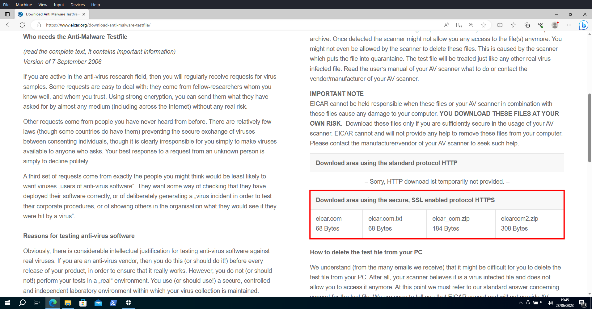

### 2.1.2 - EICAR Files
**EICAR** downloaded and extracted **files**.

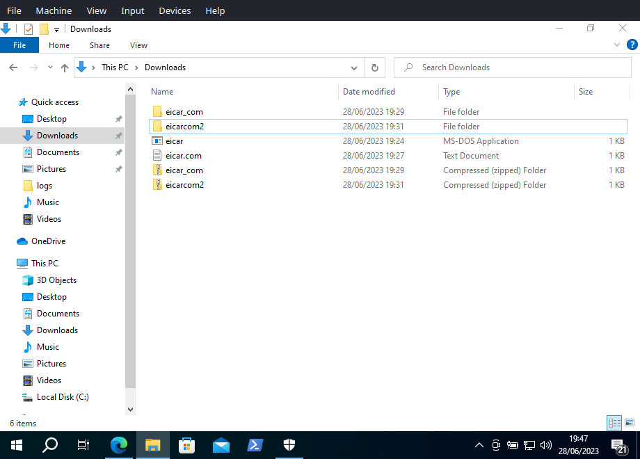

### 2.2.1 - Endpoint Security Rule
The **Endpoint Security Rule** generates a detection alert (signal) each time an **Elastic Endpoint Security** alert is received. Enabling this rule allows to investigate **Endpoint alerts** on **Elastic Security**. To perform the **EICAR Malware Test** only this rule was enabled.

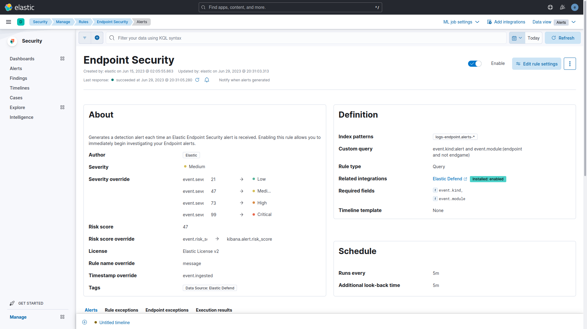

### 2.2.2 - Elastic Analytics Discover
Under the actual configuration the **EICAR Malware Test** should generate 8 alerts
sent by **Elastic Endpoint Security** and 8 signals generated by the **Endpoint Security Rule**. The test detected 14 events generated during a time spawn of 10 minutes, 7 alerts and 7 signals. During the download `eicar.com` and `eicar.com.txt`, **Elastic Endpoint Security** should send 3 alerts: one creation event of a `.tmp` file and two rename events for the `eicar.com.crdownload` file and the `eicar.com` file. The rename event of the `eicar.com.txt.crdownload` file was not detected during the trial. The compressed files should generate one alert each during the extraction of the `eicar.com`.

### 2.2.3 - Elastic Scuity Dashboard Overview
The 14 events using the filter `message: "Malware Detection Alert` where 7 of then are alerts sent by Elastic Endpoint Security and the other 7 are signals generated by the Endpoint Security Rule each time an Elasti Endpoint Security alert is received.

### 2.2.4 - Elastic Security Alerts

---

## 3 - MITRE ATT&CK Test with Red Team Automation (RTA)
[RTA](https://github.com/endgameinc/RTA) provides a framework of scripts designed to allow blue teams to test their detection capabilities against malicious tradecraft, modeled after [MITRE ATT&CK](https://attack.mitre.org/wiki/ATT&CK_Matrix).

RTA is composed of python scripts that generate evidence of over 50 different ATT&CK tactics, as well as a compiled binary application that performs activities such as file timestopping, process injections, and beacon simulation as needed.

Where possible, RTA attempts to perform the actual malicious activity described. In other cases, the RTAs will emulate all or parts of the activity. For example, some lateral movement will by default target local host (though with parameters typically allow for multi-host testing). In other cases, executables such as cmd.exe or python.exe will be renamed to make it appeas as if a Windows binary is doing non-standard activities..

### 3.1 - Alerts Over Time
All the 247 signals detected by 45 distinct rules.

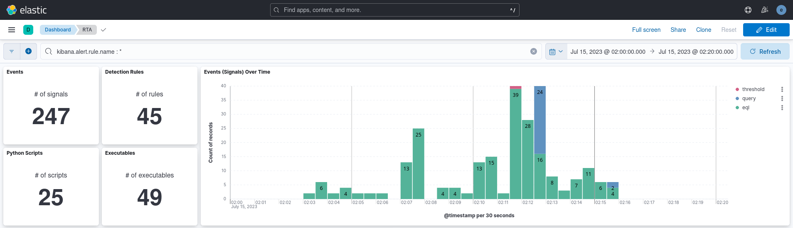

### 3.2.1 - Detection Rules and Executables
Count of all the Security SIEM detection rules used to create the alerts.

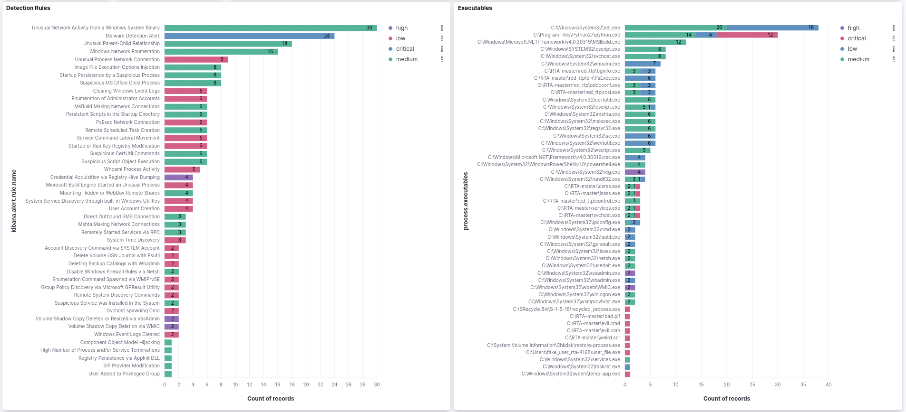

### 3.2.2 - Pythons Scripts used by RTA
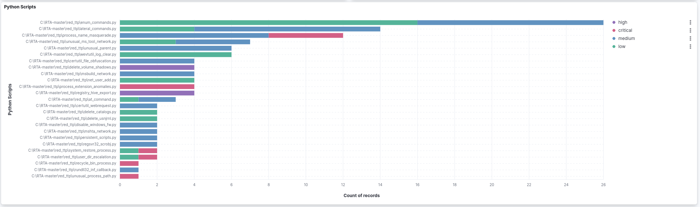

### 3.2.3 - Processes per Rule for the Top 10 Rules by Count of Records
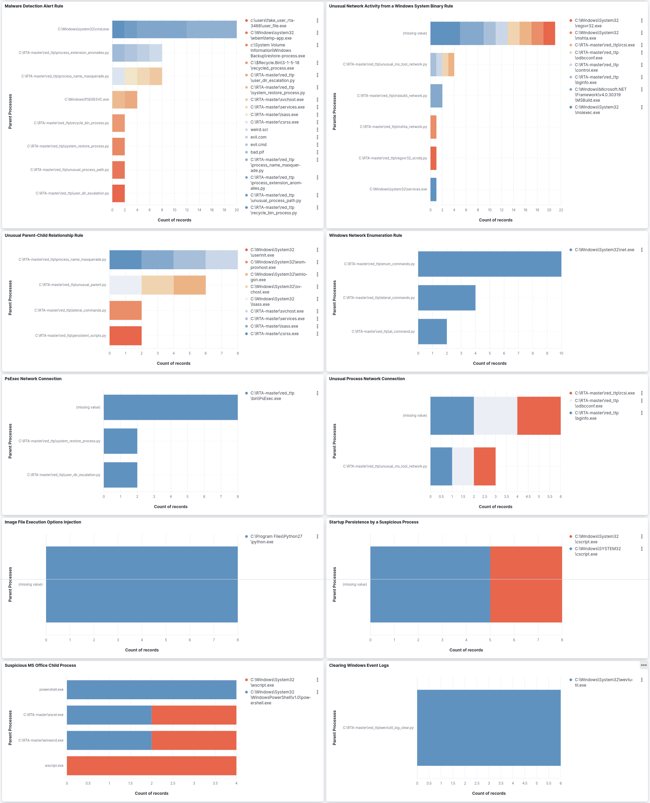

### 3.3.1 - Detection Rules Techniques and Tactics
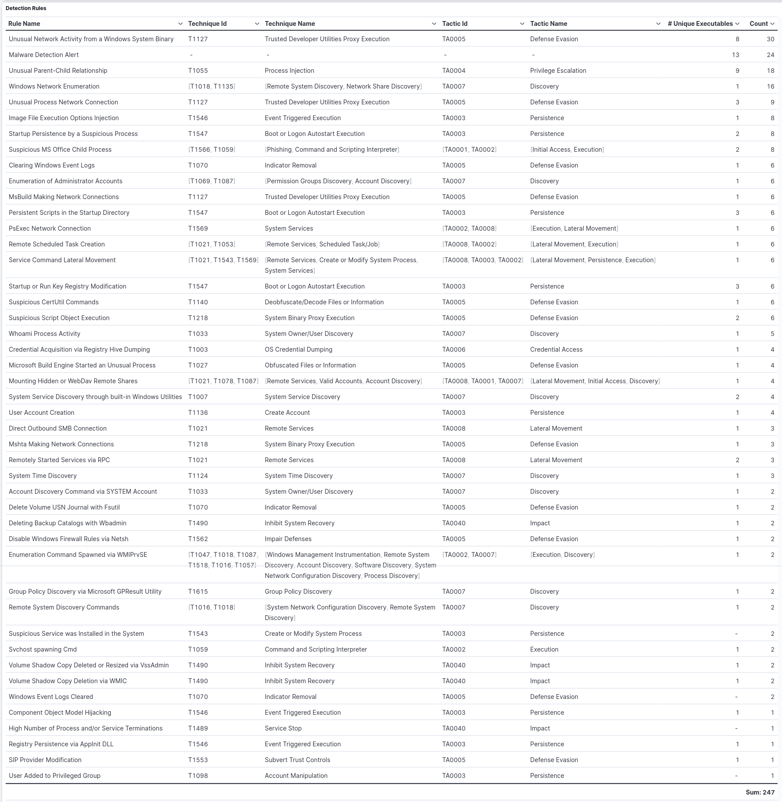

### 3.3.2 - Detection Signals in Time Order
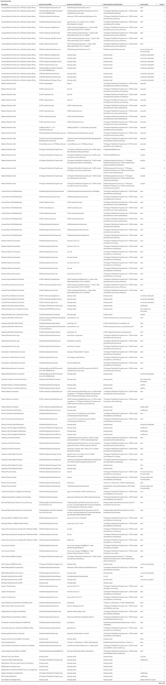

