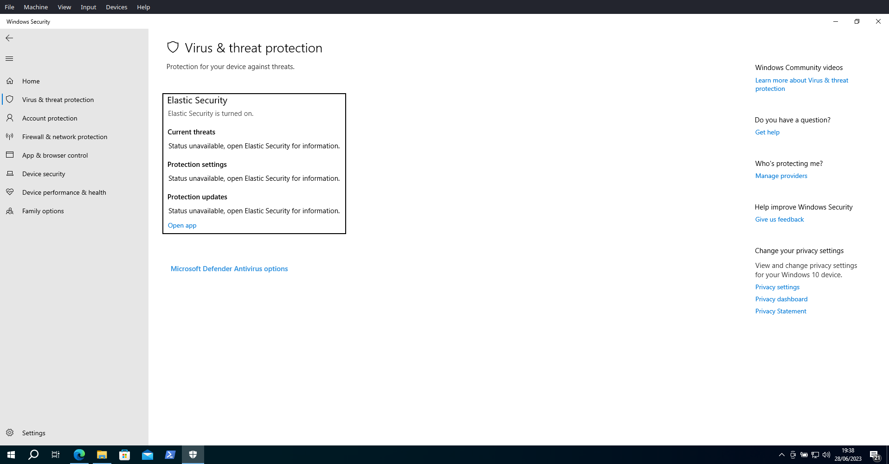
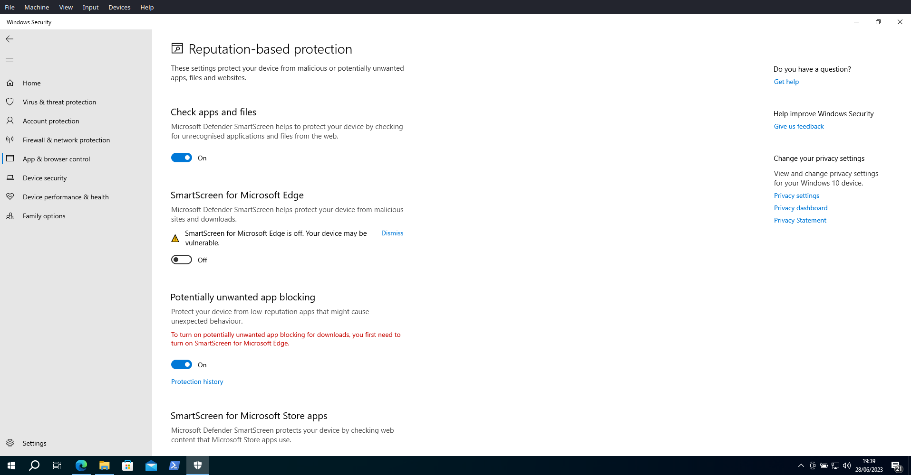
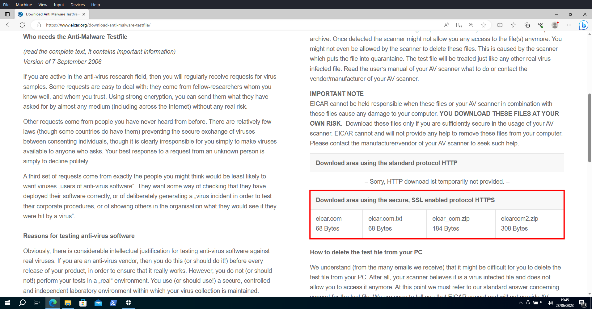
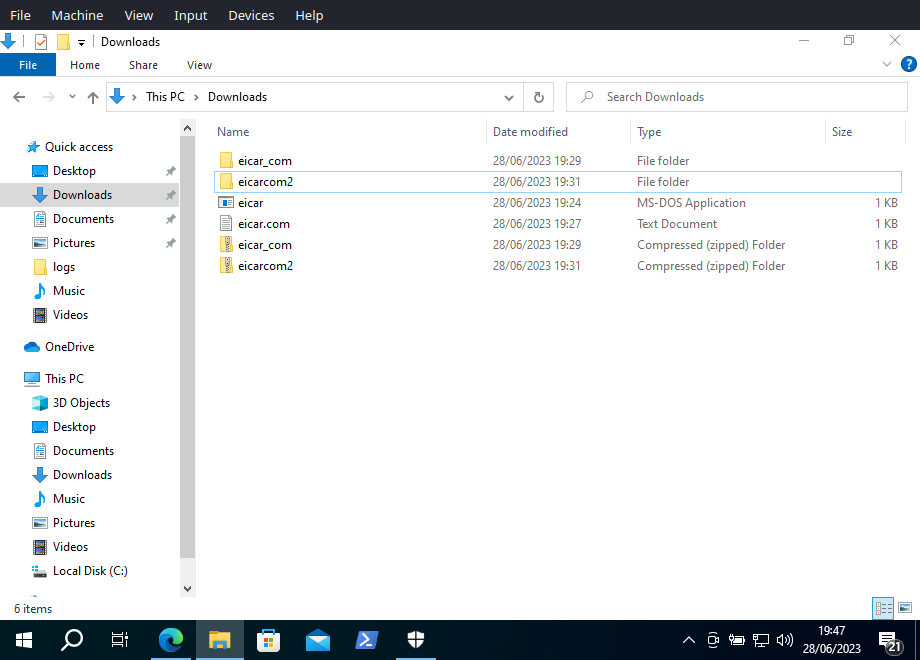
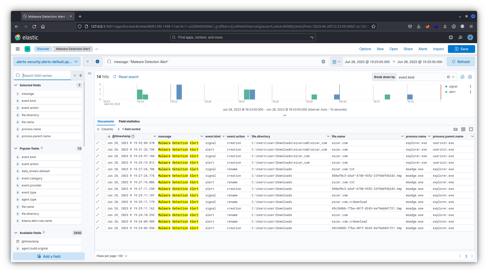
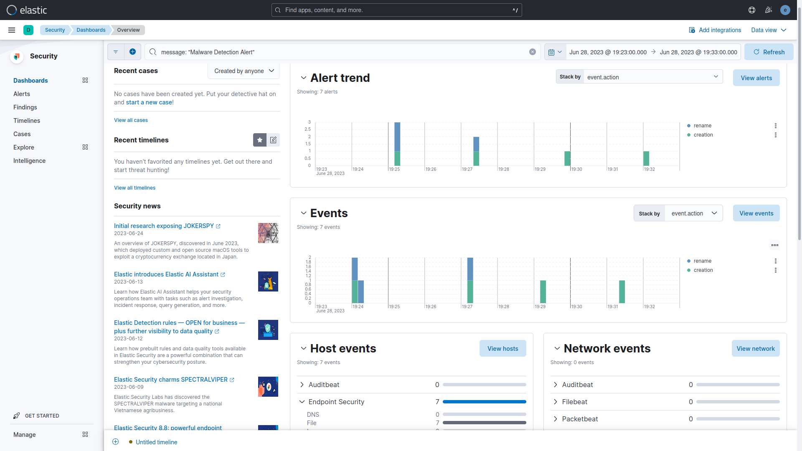
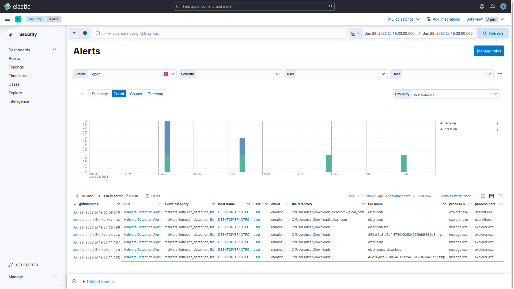

# Threat Hunting with Elastic Stack 8
- Configured in VirtualBox:
  - DHCP Server:
    - Ubuntu VM (Elastic Host)
    - Windows 10 VM (Victim)
- Configured Elastic 8.8:
  - Elastic Stack: Elasticsearch and Kibana (Web UI).
  - Integrations: Fleet Server, Elastic Agent, Elastic Defend, System, and Windows.
- Simulated two scenarios:
  - First Scenario: EICAR Malware Test.
  - Second Scenario: MITRE ATT&CK Test.

# Highlights

## First Scenario: EICAR Malware Test.

### 1. Use Elastic Security Antivirus
Use Elastic Security Antivirus from the Elastic Defender Integration instead of Microsoft Defender Antivirus or disable Real-time protection from Microsoft Defender Antivirus.

### 2. Disable SmartScreen for Microsof Edge

### 3. EICAR Malware Description

### 4. EIRCAR Website

### 5. EICAR Files
EICAR downloaded and extracted files.

### 6. Elastiv Kibana Discover

### 7. Elastic Scuity Dashboard Overview

### 8. Elastic Security Alerts

## Second Scenario: MITRE ATT&CK Test.
