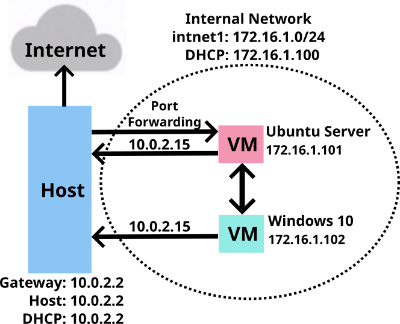
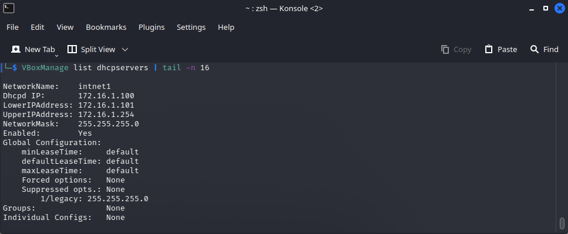
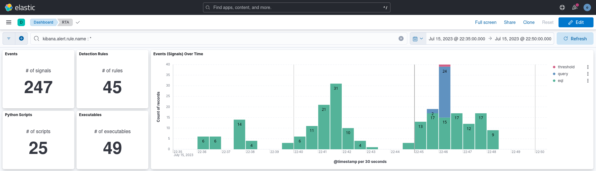

# Threat Hunting with Elastic Stack 8 (XDR)

This lab aims to explore the detection and visualization capabilities of Elastic Stack 8 by conducting malicious tests on a Windows 10 machine. Using VirtualBox, a DHCP Server was set up to provide IP addresses for an internal network with two virtual machines: an Ubuntu Server (Elastic Host) and a Windows 10 (Victim). Both virtual machines have dual network adapters, one linked to a NAT with internet access and the other to the internal network. Elastic Stack 8 was installed on the Ubuntu Server VM to detect malicious activity on the Windows 10 VM. Data was gathered from the victim's machine using the Elastic Agent.

## Summary
- Set up an Internal Network in VirtualBox, including:
  - DHCP Server
  - Ubuntu Server VM (Elastic Host)
  - Windows 10 VM (Victim)
- Installed Elastic Stack 8 on the Ubuntu Server, comprising:
  - Elasticsearch and Kibana (UI).
  - Elastic Agent with various Integrations: Fleet Server, System, Windows, and Elastic Defend.
- Conducted two simulated malicious tests:
  - EICAR Malware Test
  - MITRE ATT&CK Test using Red Team Automation (RTA).

## Tools
- **Kali Linux**
  - **VirtualBox**
    - **Ubuntu Server**
      - **Elastic Stack 8**
    - **Windows 10**
      - **EICAR Malware Test**
      - **MITRE ATT&CK Test with RTA**

## Procedure
The procedure to build this lab can be found [here](https://github.com/robsann/ElasticStackLab/blob/main/procedure.md). It was adapted from [Reda BELHAJ](https://unencrypted.vercel.app/blog/threat-hunting-with-elasticstack).

## Diagram

## VirtualBox Internal Network
The image below displays the VirtualBox Internal Network named intnet1. In this type of virtual network, the virtual machines can only communicate with each other.

### IP Addresses

Below is an image showing the IP addresses of the Ubuntu Server VM (left) and the Windows 10 VM (right).

  
# Setup Overview and Tests

## 1 - Elastic Stack 8 and Windows Security Setup
This section provides an overview of Elastic Stack 8, detailing the created policies and the integrations utilized in each policy. Additionally, it discusses the Windows Security setup employed in this lab.

### 1.1 - Elastic Stack 8
At the core of the Elastic Stack 8 comprises Elasticsearch, the robust data engine, and Kibana, the intuitive user interface. Additionally, Elastic Agent and Integrations are employed to ship data from endpoints.
- **Elasticsearch** is the distributed search and analytics engine at the heart of the Elastic Stack. Elasticsearch is where the indexing, search, and analysis happen.
- **Kibana** enables the user interface to navigate the Elastic Stack. With Kibana you can: Search, observe, and protect your data; Analyze your data; Manage, monitor, and secure the Elastic Stack.
- **Elastic Agent** is a unified way to add monitoring for logs, metrics, and other types of data to a host. It can also protect hosts from security threats, query data from operating systems, forward data from remote services or hardware, and more. 
- **Integrations** are part of the agent's policy to collect data sources such as logs and metrics, to provide security protections, and more. Agent's policy can be updated to add or remove integrations. Elastic Integrations are powered by Elastic Agent.
  

  

### 1.2 - Fleet and Elastic Agents
Fleet provides a web-based UI in Kibana for centrally managing Elastic Agents and their policies. Fleet serves as the communication channel back to the Elastic Agents. Agents check in for the latest updates regularly. When an agent policy is changed, all the agents receive the update during their next check-in. To upgrade the Elastic Agent binaries or integrations, the upgrades can be initiated in Fleet, and the Elastic Agents running on the hosts will upgrade automatically.

All communication between the Fleet UI and Fleet Server happens through Elasticsearch. Fleet writes policies, actions, and any changes to the `fleet-*` indices in Elasticsearch. Each Fleet Server monitors the indices, picks up changes, and ships them to the Elastic Agents. To communicate to the Fleet about the status of the Elastic Agents and the policy rollout, the Fleet Servers write updates to the `fleet-*` indices.

### 1.3 - Fleet Server Policy
The Fleet Server was installed on the Ubuntu Server (Elastic Host), and its policy incorporates the Fleet Server integration. The System integration was included automatically with the Fleet Server integration but was removed from the Fleet Server policy. The System integration is utilized for shipping log and metric files to the Elastic Host. It can be retained if one desires to collect logs and metrics for monitoring the host operating as the Fleet Server.

#### 1.3.1 - Fleet Server Integration
The Fleet Server is what connects Elastic Agents to Fleet. Here are some key characteristics:
- It can support an extensive infrastructure and handle numerous Elastic Agent connections.
- It is available for both Elastic Cloud and self-managed clusters.
- The Fleet Server is launched as a separate process within an Elastic Agent on a server and communicates with the deployed Elastic Agents.
- Its responsibilities include updating agent policies, gathering status information, and coordinating actions across Elastic Agents.

### 1.4 - Windows Endpoint Policy
The Windows Endpoint Policy comprises the Elastic Defend, System, and Windows integrations.
- Elastic Defend will be used as an anti-virus.
- The system will collect the logs and metrics.
- Windows will collect the event viewer logs.

#### 1.4.1 - System Integration
The System integration allows for monitoring servers, personal computers, and other devices. This integration collects metrics (state) and logs (events) from the devices. The data collected can be visualized in Kibana. Alerts can be created to notify if something goes wrong, and data can be referenced when troubleshooting an issue.

The System integration collects two types of data: logs and metrics.
- **Logs** help to keep a record of events that happen on the machine. Log data streams collected by the System integration include:
  - On Windows machines: `application`, `system`, and `security`.
  - On macOS or Linux machines: `auth` and `syslog`.
- **Metrics** give insight into the state of the machine. Metric data streams collected by the System integration include:
  - CPU usage, load statistics, memory usage, information on network behavior, and more.

In this configuration, only logs were collected.

#### 1.4.2 - Winows Integration
The Windows integration allows monitoring of the Windows OS, services, applications, and more. The Windows integration collects metrics (state) and logs (events) from the machine. These data can be visualized in Kibana, alerts to notify if something goes wrong can be created, and data can be referenced when troubleshooting an issue.

The Windows integration collects two types of data: logs and metrics.
- **Logs** help to keep a record of events that happen on the machine. Log data streams collected by the Windows integration include:
	- `forwarded events`, `PowerShell events`, and `Sysmon events`.

	Log collection for the Security, Application, and System event logs is handled by the System integration.
- **Metrics** give insight into the state of the machine. Metric data streams collected by the Windows integration include:
	- `service details` and `performance counter values`.

In this configuration, only logs were collected.

#### 1.4.3 - Elastic Defend Integration
The Elastic Defend integration provides prevention, detection, and response capabilities across Windows, macOS, and Linux operating systems running on traditional endpoints and public cloud environments. In this setup, Elastic Defend Malware protection was used for threat detection.

The Elastic Defend integration collects two types of data: logs and metrics.
- **Logs** - The log type of documents are stored in the `logs-endpoint.*` indices. The following sections define the mapped fields sent by the endpoint:
  - `alerts`, `file`, `library`, `network`, `process`, `registry`, and `security`.
- **Metrics** - The metrics type of documents are stored in `metrics-endpoint.*` indices. Metrics documents contain performance information about the endpoint executable and the host it is running on. The following section defines the mapped fields sent by the endpoint:
  - `metadata`, `metrics`, and `policy response`.

Malware protection was activated in Detect mode, and Elastic Security Antivirus was designated as the official antivirus solution for the Windows 10 virtual machine, automatically deactivating Windows Defender Antivirus.

### 1.5 - Windows Security
The tests were performed with the Elastic Security Antivirus active and the SmartScreen for Microsoft Edge turned off.

#### 1.5.1 - Elastic Security Antivirus
The Elastic Security Antivirus, integrated with Elastic Defender, was employed instead of Microsoft Defender Antivirus. Alternatively, Microsoft Defender Antivirus can be used for testing, with Real-time protection disabled, to be able to save on disk the malicious files.

#### 1.5.2 - Microsoft Defender SmartScreen
The SmartScreen for Microsoft Edge was turned off, enabling to download the malicious files in the EICAR Malware Test.

---

## 2 - EICAR Malware Test

The EICAR Ant-Virus Test File or EICAR test file is a computer file that was developed by the European Institute for Computer Antivirus Research (EICAR) and the Computer Antivirus Research Organization (CARO) to test the response of computer antivirus (AV) programs.

The EICAR test file is one of the most well-known security strings that can be used to check the level of protection an antivirus software can offer. The EICAR Standard Anti-Virus Test File contains the ASCII string which, when interpreted by the command processor, returns the message string to the standard output and exits back to the command prompt. This test file holds a simple text file which they call `eicar.com` containing the ASCII string, which they use in scanning files.

<!--  -->

### 2.1.1 - EIRCAR Website
In the [EICAR website](https://www.eicar.org/download-anti-malware-testfile/), under the Download area using the secure, SSL-enabled protocol HTTPS, the four versions of the `eicar.com` file can be downloaded: the original file, the `eicar.com.txt` variant, and two compressed files, one with `eicar.com` compressed one time (`eicar_com.zip`) and the other two times (`eicarcom2.zip`).

### 2.1.2 - EICAR Files
EICAR downloaded and extracted files.

### 2.2.1 - Endpoint Security Rule
The Endpoint Security Rule generates a detection alert (signal event) each time an Elastic Endpoint Security alert event is received. Enabling this rule allows the investigation of Endpoint alerts on Elastic Security. Only this rule was enabled to perform the EICAR Malware Test.

### 2.2.2 - Elastic Analytics Discover
Under the current configuration, the EICAR Malware Test should generate 16 events: 8 alerts sent by Elastic Endpoint Security and 8 signals generated by the Endpoint Security Rule. During the download of the `eicar.com` file, Elastic Endpoint Security should send three alerts: one creation event of a `.tmp` file and two rename events for the `eicar.com.crdownload` and `eicar.com` files. The same should happen for the `eicar.com.txt` file and the compressed files should generate one alert each during the extraction of the `eicar.com` file. The current test detected 14 events using the filter `message: "Malware Detection Alert`: 7 alerts and 7 signals. The renaming event of the `eicar.com.txt.crdownload` file was not detected during the trial.

### 2.2.3 - Elastic Security Dashboard Overview
On `Security > Dashboards > Overview`, using the filter `message: "Malware Detection Alert"`, it can be seen in the middle on Events the 7 alert events received from Elastic Endpoint Security and at the top on Alert trend the 7 signal events generated by the Endpoint Security Rule. At the bottom, the Host events section shows that the 7 events sent by Endpoint Security were from the File category.

### 2.2.4 - Elastic Security Alerts
On `Security > Alerts`, it is shown the 7 alerts (signal events) generated by the Malware Detection Alert rule: four creation events for each file and two rename events for `eicar.com.crdownload` and `eicar.com`, and one rename event for `eicar.com.txt`.

---

## 3 - MITRE ATT&CK Test with Red Team Automation (RTA)
[RTA](https://github.com/endgameinc/RTA) provides a framework of scripts designed to allow blue teams to test their detection capabilities against malicious tradecraft, modeled after [MITRE ATT&CK](https://attack.mitre.org/wiki/ATT&CK_Matrix).

RTA is composed of Python scripts that generate evidence of over 50 different ATT&CK tactics, as well as a compiled binary application that performs activities such as file time-stopping, process injections, and beacon simulation as needed.

Where possible, RTA attempts to perform the malicious activity described. In other cases, the RTAs will emulate all or parts of the activity. For example, some lateral movement will, by default, target the local host (though parameters typically allow for multi-host testing). In other cases, executables such as cmd.exe or python.exe will be renamed to make it appear as if a Windows binary is doing non-standard activities.

To run the MITRE ATT&CK Test with RTA, all the rules in `Security > Manage > Rules` on Kibana were enabled except the My First Rule rule, Multiple Alerts Involving a User rule, and Multiple Alerts in Different ATT&CK Tactics on a Single Host rule. Furthermore, all the rules with Failed or Warning in the Last Response field were disabled.

### 3.1 - Alerts Over Time
The test took less than 15 minutes and generated 247 signal events by 45 detection rules that detected the activity of 25 Python scripts using 49 unique executables. The chart below shows the signal events generated over time.

### 3.2.1 - Detection Rules and Executables
The chart on the left shows all the 45 Security SIEM detection rules used to generate alerts (signal events), with the rules sorted and color-coded by their severity classification. Meanwhile, the chart on the right displays all the 49 detected executables sorted by the number of records and color-coded according to the event's severity classification.

### 3.2.2 - Python Scripts used by RTA
The chart shows 25 Python scripts that were detected during the test. They are sorted by the number of records and color-coded based on the severity classification of the events.

### 3.2.3 - Processes per Rule for the Top 10 Rules by Count of Records
This chart displays the top 10 rules based on the count of records, with the parent process on the left axis and the child processes represented in the legend.

### 3.3.1 - Detection Rules, Techniques, and Tactics
Table with the 45 detection rules with the id and name for the technique and tactic, the number of unique executables detected by the rule, and the count of how many signal events the rule generated.

### 3.3.2 - Detection Signals in Time Order
The following table contains the commands executed in the process and the parent process for each rule activated during the test. The table also shows each command's username and event action and severity.

