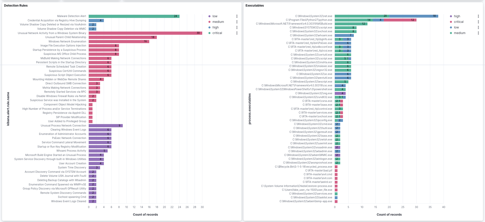
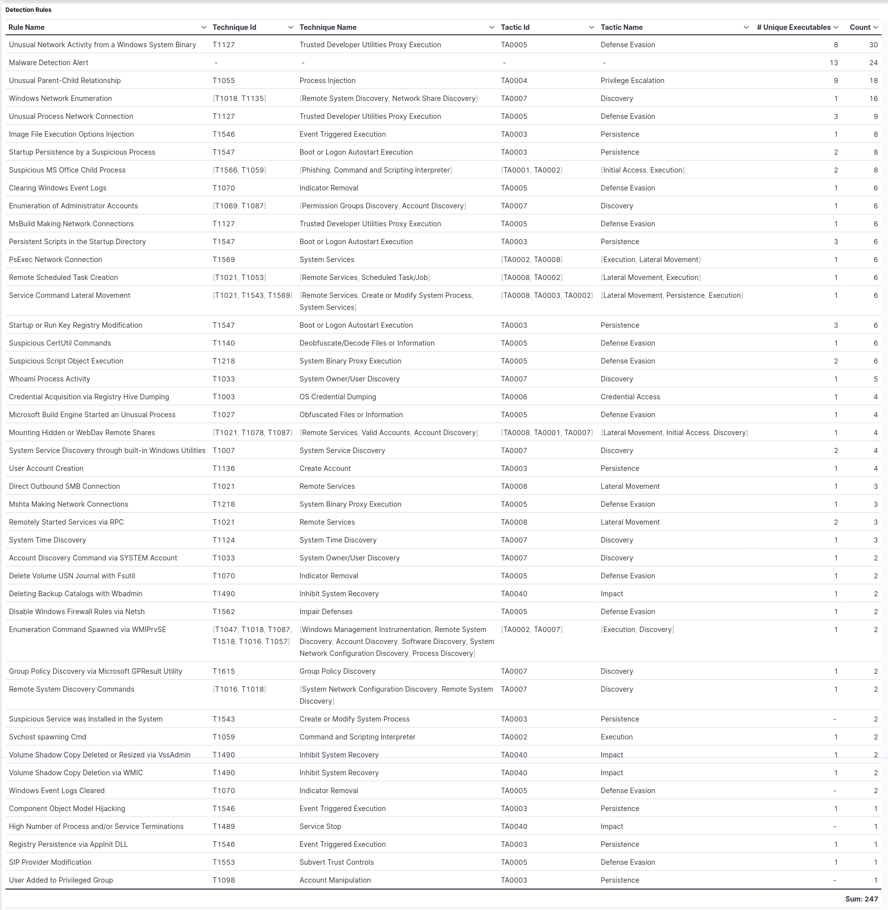

# Threat Hunting with Elastic Stack 8
- Configured in VirtualBox:
  - DHCP Server:
    - Ubuntu VM (Elastic Host)
    - Windows 10 VM (Victim)
- Configured Elastic 8.8:
  - Elastic Stack: Elasticsearch and Kibana (Web UI).
  - Integrations: Fleet Server, Elastic Agent, Elastic Defend, System, and Windows.
- Simulated two scenarios:
  - First Scenario: EICAR Malware Test.
  - Second Scenario: MITRE ATT&CK Test.

# Highlights

## 1 - Elastic Host and Victim Setup

### 1.1 - Fleet Agents

### 1.2 - Fleet Server Policy

#### 1.2.1 - Fleet Server Integration

### 1.3 - Windows Endpoint Policy

#### 1.3.1 - Elastic Defend Integration

#### 1.3.2 - System Integration

#### 1.3.3 - Winows Integration

### 1.4 - Endpoint Security Rule
The Endpoint Security Rule generates a detection alert (signal) each time an Elastic Endpoint Security alert is received. Enabling this rule allows you to investigate your Endpoint alerts on Elastic Security.

### 1.5 - Windows Security

#### 1.5.1 - Elastic Security Antivirus
Use Elastic Security Antivirus from the Elastic Defender Integration instead of Microsoft Defender Antivirus or disable Real-time protection from Microsoft Defender Antivirus.

#### 1.5.2 - Microsoft Defender SmartScreen

## 2 - First Scenario: EICAR Malware Test.

### 2.1.1 - EICAR Malware Description

### 2.1.2 - EIRCAR Website

### 2.1.3 - EICAR Files
EICAR downloaded and extracted files.

### 2.2.1 - Elastiv Analytics Discover

### 2.2.2 - Elastic Scuity Dashboard Overview

### 2.2.3 - Elastic Security Alerts

## 3 - Second Scenario: MITRE ATT&CK Test.

### 3.1 - Alerts Over Time
All the 249 alerts detected by 47 distinct rules.

### 3.2.1 - Detection Rules and Executables
Count of all the Security SIEM detection rules used to create the alerts.

### 3.2.2 - Processes per Rule for the Top 10 Rules by Count of Records

### 3.3.1 - Detection Rules Techniques and Tactics

### 3.3.2 - Command Line of Process and Parent Process per Rule

